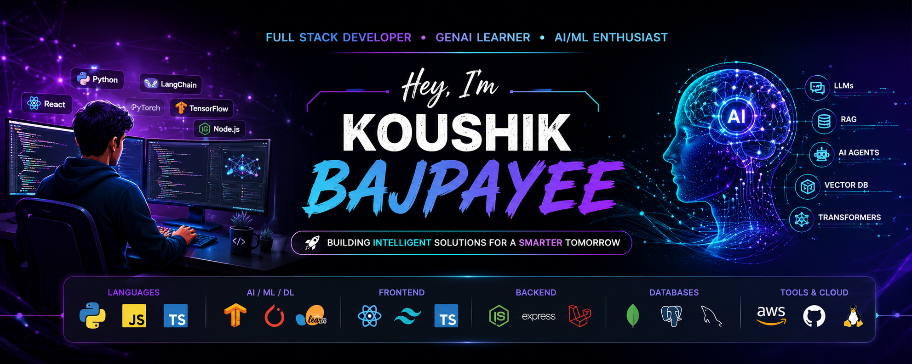

<p align="center">
  
</p>
<div align="center">

# 👋 Hey, I'm Koushik Bajpayee

### ⚡ Full Stack Developer • GenAI Learner • AI/ML Enthusiast ⚡


<br>


<br><br>


</div>

---

# 🧠 About Me

I’m a developer transitioning into the world of **Generative AI, NLP, Machine Learning, and Deep Learning**.

Currently exploring how modern AI systems work — from classical NLP techniques to **Transformers, LLMs, RAG pipelines, vector embeddings, and AI agents**.

I have experience building full-stack applications using **React, Node.js, Express.js, Laravel, MongoDB, PostgreSQL, and MySQL**, and I'm now focused on combining software engineering with modern AI systems.

My goal is to become a strong **GenAI Engineer** who builds intelligent, scalable, real-world AI applications.

* 🔥 Learning NLP, Deep Learning, Transformers, LLMs & RAG
* 💻 Building AI + Full Stack projects using Python & JavaScript
* 🧠 Exploring the evolution from traditional ML to modern Generative AI
* ⚡ Consistently learning and building in public
* 🚀 Goal: Become a GenAI Engineer

---

# 🔭 Currently Building

<div align="center">

| 🚀 Project            | 🎯 Focus                  |
| --------------------- | ------------------------- |
| 🤖 RAG Applications   | LangChain + Vector Search |
| 📚 LangGraph Projects | AI Workflows              |
| 🧠 Deep Learning      | PyTorch                   |
| 🌐 Portfolio Website  | React + Three.js          |
| ⚡ AI Agents           | LLM Automation            |

</div>

---

# 📈 Learning Progress

```text
Machine Learning      ██████████ 100%
NLP                   ██████████ 100%
Embeddings            ██████████ 100%
Deep Learning         ████████░░ 80%
RNN & LSTM            ██████░░░░ 60%
Transformers          █████░░░░░ 50%
LangChain             █████░░░░░ 50%
LangGraph             ████░░░░░░ 40%
RAG                   ████░░░░░░ 40%
AI Agents             ██░░░░░░░░ 20%
```

---

# 🛠️ Tech Stack

## 🧠 AI / ML / NLP

<div align="center">


<br><br>


</div>

---

## 💻 Frontend

<div align="center">


</div>

---

## ⚙️ Backend

<div align="center">


</div>

---

## 🗄️ Databases

<div align="center">


</div>

---

## ☁️ Cloud & DevOps

<div align="center">


</div>

---

# 🚀 Featured Projects

## 🤝 DevTinder – Developer Networking Platform

A MERN-based platform where developers connect, collaborate and grow.

* Authentication & Authorization
* Connection Requests
* Real-time Chat
* Secure REST APIs
* AWS Deployment

**Tech:** React • Node.js • Express.js • MongoDB

---

## 🏥 Prescripto – Doctor Appointment System

Production-ready healthcare booking platform.

* Appointment Scheduling
* Doctor Management
* JWT Authentication
* Cloudinary Integration

**Tech:** React • Node.js • MongoDB

---

## 🍔 FoodApp – React + Redux Toolkit

Modern food ordering application.

* Search & Filter
* Redux Toolkit
* Responsive UI
* Performance Optimization

**Tech:** React • Redux Toolkit

---

## 🤖 RAG PDF Chatbot

AI-powered document question answering system.

* PDF Processing
* Text Chunking
* Embedding Generation
* FAISS Vector Search
* LLM-powered Answers

**Tech:** Python • LangChain • FAISS

---

# 📊 GitHub Analytics

<div align="center">


<br><br>


</div>

<br>

# 📈 Contribution Activity

<div align="center">


</div>

---

# 🎯 2026 Goals

* Build Production-Ready RAG Systems
* Master Transformers & LLMs
* Develop AI Agents
* Contribute to Open Source
* Land a GenAI Engineer Role
* Build End-to-End AI Applications

---

# 🌐 Connect With Me

<div align="center">

<a href="https://www.linkedin.com/in/koushikbajpayee07/">LinkedIn</a> • <a href="https://github.com/koushikbajpayee06">GitHub</a> • <a href="mailto:kbajpayee06@gmail.com">Email</a>

</div>

---


<div align="center">

## 🚀 Build • Learn • Evolve

### *"The future belongs to engineers who understand both software and intelligence."*

</div>
